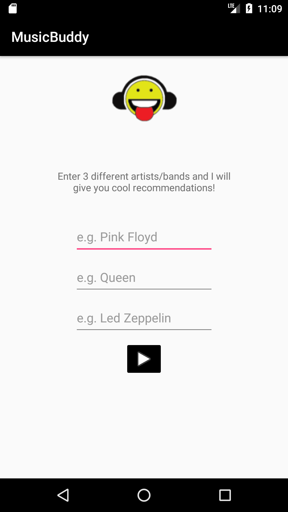
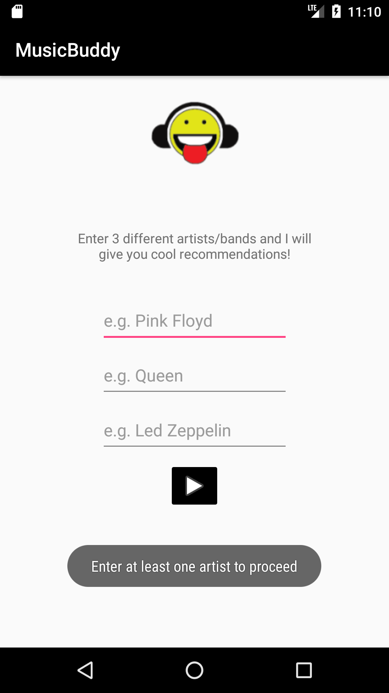
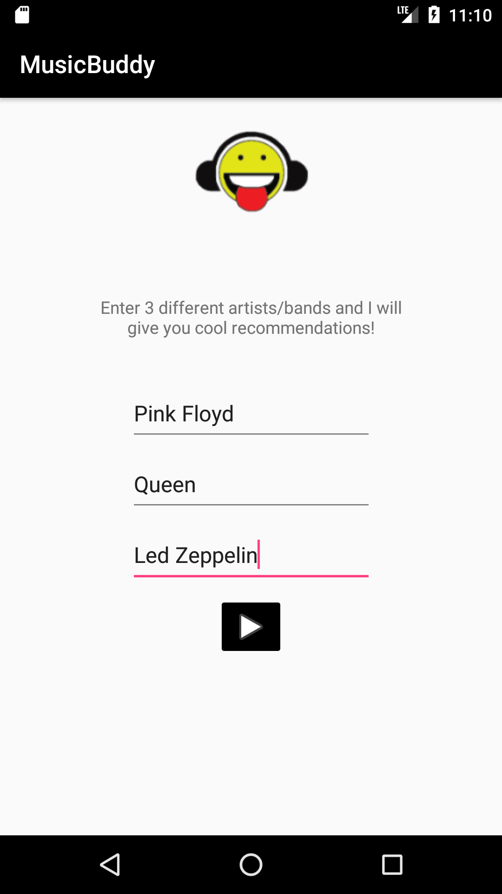

# MusicBuddy
App that gives music suggestions based on the user's personal taste.

## 1. User input

User must enter at least one artist to proceed.

## 2. Recommendations

After entering your favorite artists the app gives you a suggestion based on your personal taste. You can tap on the Youtube icon to listen to a song of the artist and also tap on the Wikipedia icon to read an article about the artist.

	
